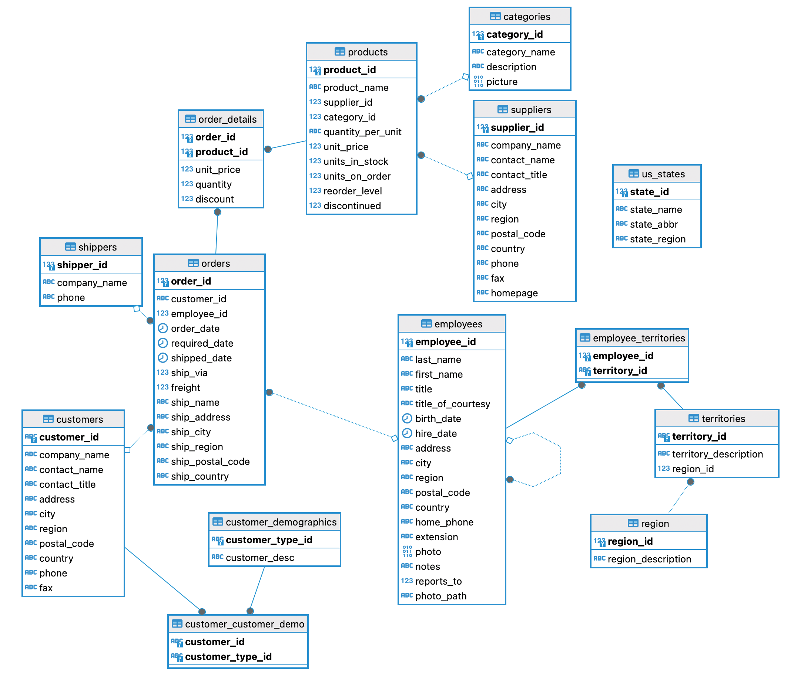
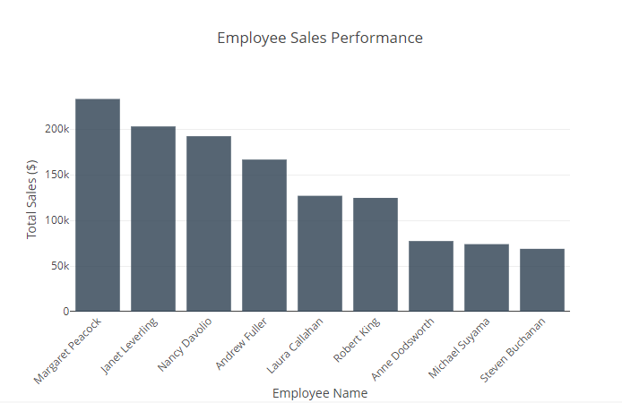
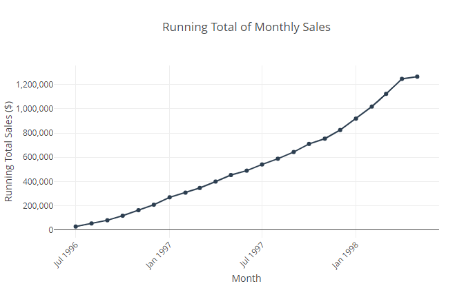
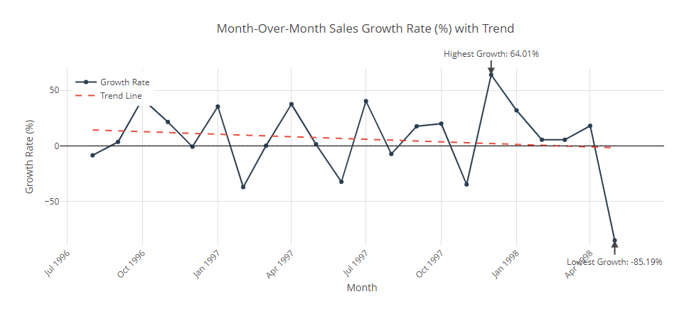
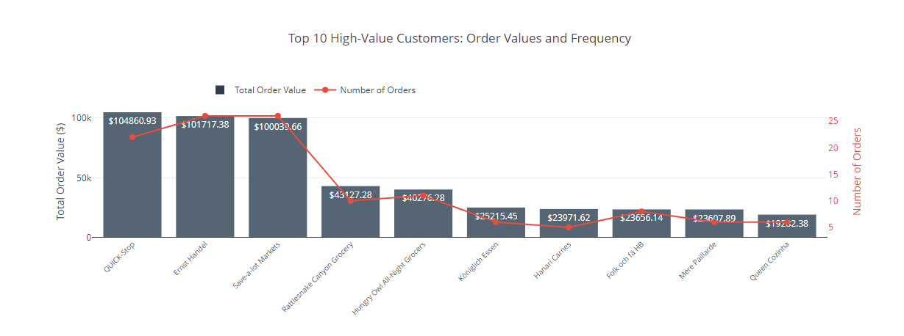
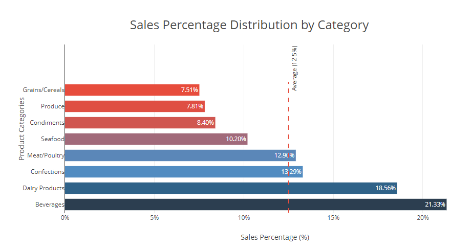
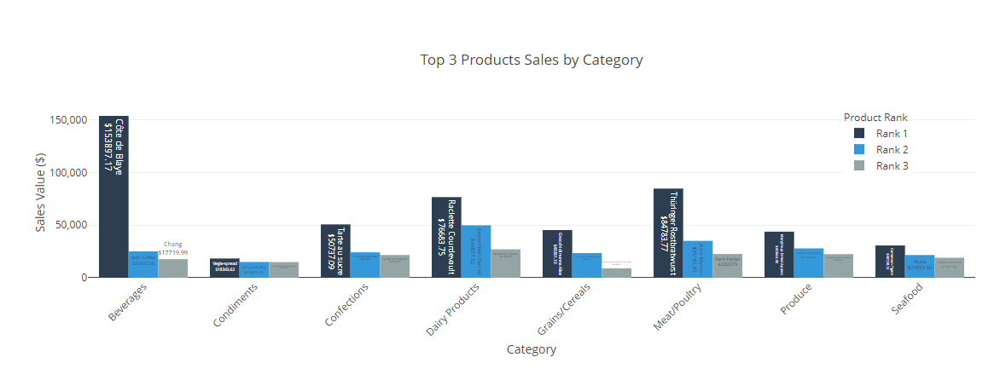

# Northwind Traders Exploratory Data Analysis

## Overview
This project performs exploratory data analysis on Northwind Traders, an international gourmet food distributor. The analysis aims to provide actionable insights to support strategic business decisions.

## Project Description
The Northwind database represents a fictional trading company's operations, including:

* Customer orders and transactions
* Product inventory and categories
* Employee and supplier information
* Shipping and logistics data

## Tools and Technologies
* SQL (PostgreSQL)
* Jupyter Notebook

## Database Schema

The analysis works with the standard Northwind database schema, which includes tables such as:
`Customers, Orders, Products, Categories, Employees, Suppliers`



## Notebook
View notebook with detailed at [here](https://github.com/haajar-es/data-analytics-dojo/blob/main/northwind-traders-exploratory-data-analysis/notebook/Exploratory%20Analysis%20for%20Northwind%20Traders.ipynb).

## Key Analysis
  
### 1. Employee Sales Performance

```sql
WITH employees_sales AS (
	SELECT 
		employees.employee_id,
		employees.first_name ||' '||employees.last_name AS full_name,
		SUM(order_details.unit_price * order_details.quantity * (1 - discount)) AS total_sales
	FROM orders
	JOIN employees 
		ON orders.employee_id = employees.employee_id 
	JOIN order_details
		ON orders.order_id = order_details.order_id 
	GROUP BY employees.employee_id, first_name ||' '||last_name
)
SELECT 
	employee_id,
	full_name,
	total_sales,
	RANK() OVER(ORDER BY total_sales DESC) AS sales_rank
FROM employees_sales;
```


* **Margaret Peacock** ranks first with the highest total sales, followed by Janet Leverling and Nancy Davolio, while **Steven Buchanan** has the lowest total sales among other listed employees.
* **Replicating Success:** Identify elements of Margaret's approach that can be shared with the team for emulation.
* **Recognition and Incentives:** Acknowledge Margaret's achievements to motivate her and others, fostering a culture of recognition for excellence.
* **Tailored Training:** Offer personalized training sessions to address specific areas where Steven might be lacking.

### 2. Monthly Sales Progress

```sql
WITH monthly_sales AS (
	SELECT 
		DATE_TRUNC('month', order_date)::DATE AS month_sales,
		SUM(unit_price * quantity * (1 - discount)) AS total_sales
	FROM orders 
	JOIN order_details 
		ON orders.order_id = order_details.order_id 
	GROUP BY DATE_TRUNC('month', orders.order_date)
)
SELECT 
	month_sales,
	SUM(total_sales) OVER(ORDER BY month_sales) AS running_total
FROM monthly_sales
ORDER BY month_sales;
```


Based on the sales growth trend chart, here are 3 main key points:

- **Accelerated Growth Pattern**
  * Started modestly at $27,862 in July 1996
  * Achieved exponential growth, reaching $1.27M by May 1998
  * Growth rate accelerated significantly in the latter part of 1997 and early 1998

- **Notable Milestone Achievements**
  * Hit $250K milestone within 6 months (January 1997)
  * Doubled to $500K in next 6 months (July 1997)
  * Doubled again to $1M in following 7 months (February 1998)

- **Consistent Upward Trajectory**
  * No significant downward trends or plateaus
  * Maintained steady growth throughout the entire period
  * Most aggressive growth phase occurred in final 6 months
  * Demonstrates strong and sustainable business performance


### 3. Month-Over-Month Sales Growth

```sql
WITH monthly_sales AS (
	SELECT 
		EXTRACT(MONTH from order_date) AS month,
		EXTRACT(YEAR from order_date) AS year,
		SUM(unit_price * quantity * (1 - discount)) AS total_sales
	FROM orders 
	JOIN order_details 
		ON orders.order_id = order_details.order_id 
	GROUP BY 
		EXTRACT(MONTH from order_date),
		EXTRACT(YEAR from order_date)
),
lagged_sales AS (
	SELECT
		month, 
		year,
		total_sales,
		LAG(total_sales) OVER(ORDER BY year, month) AS prev_month_sales
	FROM monthly_sales 
)
SELECT 
	year,
	month,
	((total_sales - prev_month_sales) / prev_month_sales) * 100 AS growth_rate
FROM lagged_sales;
```



Based on the month-over-month sales growth rate chart with trendline, here are 3 main points:

- **High Volatility**
  * Significant fluctuations ranging from +64.01% (December 1997) to -85.19% (May 1998)
  * Frequent swings between positive and negative growth
  * Most months show growth rate changes of ±20% or more

- **Growth Cycles**
  * Pattern of sharp increases followed by notable declines
  * Strong positive spikes in October 1996 (42.21%), April 1997 (37.58%), and December 1997 (64.01%)
  * Major contractions in February 1997 (-37.18%), June 1997 (-32.39%), and May 1998 (-85.19%)
  
- **Overall Trend**
  * Slightly downward trending growth rate over the entire period
  * Despite high monthly variations, the trendline indicates gradually decreasing growth momentum
  * Most substantial growth periods occurred in the middle of the analyzed timeframe (1997)
  * Final month shows the most severe decline, potentially indicating a concerning shift in business performance


### 4. Top 10 High-Value Customers

```sql
WITH ordersvalue AS (
	SELECT 
		orders.customer_id,
		orders.order_id,
		customers.company_name,
		SUM(unit_price * quantity * (1 - discount)) AS order_value
	FROM orders
	JOIN order_details 
		ON orders.order_id = order_details.order_id 
	JOIN customers
		ON orders.customer_id = customers.customer_id
	GROUP BY orders.customer_id, orders.order_id, customers.company_name
),
values_cat AS (
	SELECT 
		customer_id,
		company_name,
		order_id,
		order_value,
		CASE 
			WHEN order_value > AVG(order_value) OVER() THEN 'Above Average'
			ELSE 'Below Average'
		END AS value_category
	FROM ordersvalue
)
SELECT 
	value_category,
	customer_id,
	company_name,
	COUNT(order_id) AS total_orders,
	SUM(order_value) AS total_value_orders
FROM values_cat
WHERE value_category IN ('Above Average')
GROUP BY customer_id, value_category, company_name
ORDER BY SUM(order_value) DESC
LIMIT 10;
```



- Top Tier Performance
  * Three clear leaders: QUICK-Stop, Ernst Handel, and Save-a-lot Markets
  * Each generating over $100,000 in order value
  * Ernst Handel and Save-a-lot Markets show highest order frequency (26 orders each)

- Value-Volume Relationship
  * Significant value drop between top 3 and remaining customers (gap of ~$57,000)
  * Mid-tier customers (Rattlesnake Canyon and Hungry Owl) show moderate order values (~$40,000) with fewer orders
  * Bottom 5 customers all under $26,000 in total order value

- Order Pattern Insights
  * Order frequency doesn't always correlate with total value
  * QUICK-Stop achieves highest value ($104,860) with fewer orders (22) than competitors
  * Lower-value customers typically show lower order frequency (5-8 orders)

### 5. Sales Percentage by Category

```sql
WITH category_sales AS (
	SELECT 
		categories.category_id,
		categories.category_name,
		SUM(quantity * products.unit_price * (1 - discount)) AS total_sales
	FROM order_details
	JOIN products 
		ON order_details.product_id = products.product_id 
	JOIN categories
		ON products.category_id = categories.category_id 
	GROUP BY categories.category_id, categories.category_name
)
SELECT 
	category_id,
	category_name,
	total_sales / SUM(total_sales) OVER() * 100 AS sales_percentage
FROM category_sales
ORDER BY sales_percentage DESC;
```



- Category Leaders
  * Beverages dominates with 21.3% of total sales
  * Dairy Products follows strongly at 18.6%
  * Top 2 categories account for nearly 40% of all sales

- Mid-Range Performance
  * Confections and Meat/Poultry each contribute ~13%
  * Seafood generates 10.2% of sales
  * These middle 3 categories represent about 36% of sales

- Growth Opportunities
  * Bottom 3 categories (Condiments, Produce, Grains/Cereals) each contribute <8%
  * All lower-performing categories fall below the 12.5% average
  * Clear opportunity gap between top and bottom performers suggests potential for targeted growth strategies

### 6. Top Products By Category

```sql
WITH product_sales AS (
	SELECT 
		products.category_id,
		categories.category_name,
		products.product_id,
		products.product_name,
		SUM(quantity * products.unit_price * (1 - discount)) AS total_sales
	FROM products 
	JOIN order_details 
		ON order_details.product_id = products.product_id 
	JOIN categories 
		ON categories.category_id = products.category_id 
	GROUP BY 
		products.category_id,
		categories.category_name,
		products.product_id
)
SELECT 
	category_id,
	category_name,
	product_id,
	product_name,
	total_sales
FROM (
	  SELECT
	  	category_id, category_name, product_id, product_name, total_sales,
	  	ROW_NUMBER() OVER(PARTITION BY category_id ORDER BY total_sales DESC) AS rn
	  FROM product_sales
	  ) 
WHERE rn <= 3;
```



Based on the top products per category analysis chart, here are 3 main points:

- **Category Value Leaders**
  * Beverages category shows the highest individual product value (Côte de Blaye at ~$154,000) , 25% of total revenue
  * Meat/Poultry has strong performance (Thüringer Rostbratwurst at ~$85,000)
  * Dairy Products shows consistent high values across all three top products
  * Clear dominance of certain categories in terms of individual product sales

- **Value Distribution Patterns**
  * Most categories show a steep decline between 1st and 3rd ranked products
  * Notable exceptions:
    * Seafood shows the most even distribution among its top 3 products
    * Condiments has relatively similar values across all three products
    * Largest value gaps appear in Beverages and Meat/Poultry categories

- **Category Performance Clusters**
  * High-value cluster: Beverages, Dairy Products, Meat/Poultry (top products >$75,000)
  * Mid-value cluster: Confections, Grains/Cereals, Produce (top products $40,000-$50,000)
  * Lower-value cluster: Condiments, Seafood (top products <$35,000)
  * Suggests different pricing strategies or sales volumes across categories

## Conclusion

### Business Impact

* Identified key areas for sales team optimization
* Revealed opportunities for inventory management improvement
* Highlighted potential for market expansion
* Discovered untapped customer segments
 
### Recommendations

1. **Sales Strategy**
   * Implement targeted training for underperforming regions
   * Develop territory-specific sales approaches
   * Enhance cross-selling initiatives
2. **Product Management**
   * Optimize inventory levels based on turnover analysis
   * Focus marketing efforts on high-margin products
   * Develop promotion strategies for seasonal products
3. **Customer Engagement**
   * Launch loyalty program for high-value customers
   * Implement targeted marketing campaigns
   * Develop region-specific customer acquisition strategies
4. **Operational Efficiency**
   * Streamline order processing in high-volume regions
   * Optimize delivery routes based on customer clustering
   * Enhance inventory management systems


### Future Opportunities
* Customer segmentation study
* Pricing optimization analysis
* Seasonal trend deep-dive
* Supply chain efficiency assessment
* Expansion into new geographic markets
* Development of new product categories
* Implementation of advanced analytics tools
* Enhanced customer relationship management systems


## Getting Started
1. Clone the repository
2. Ensure you have Jupyter Notebook installed
3. Install required Python dependencies
4. Open the notebook in Jupyter Lab/Notebook environment

<br><hr>
[🔼 Back to top](#northwind-traders-exploratory-data-analysis)
