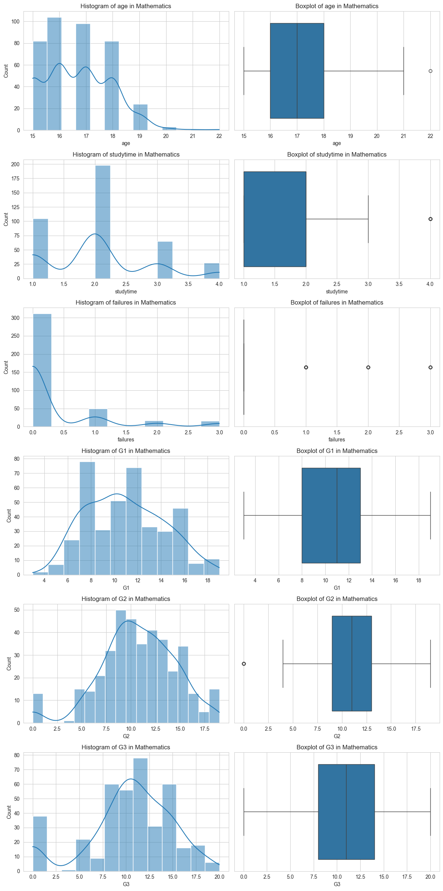
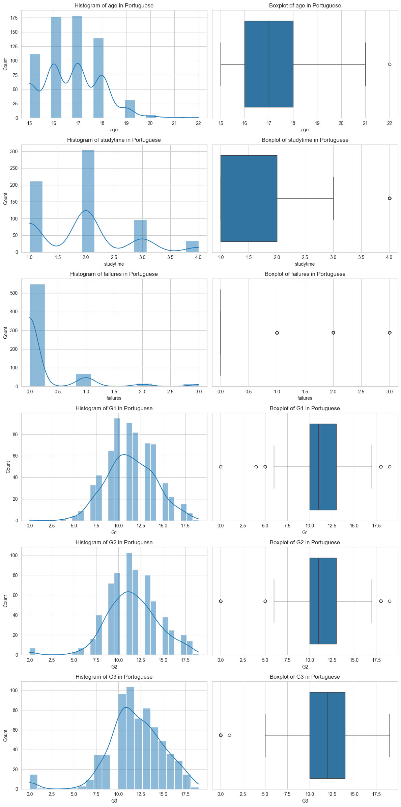

# Student Performance Analysis

- [Student Performance Analysis](#student-performance-analysis)
  - [Project Overview](#project-overview)
  - [Objectives](#objectives)
  - [Tools \& Libraries](#tools--libraries)
  - [Dataset Description](#dataset-description)
  - [Notebook](#notebook)
  - [Data Visualization](#data-visualization)
    - [Result - Mathematic](#result---mathematic)
    - [Mathematics Insights:](#mathematics-insights)
    - [Result - Portugese Language](#result---portugese-language)
    - [Portuguese Language Insights:](#portuguese-language-insights)
  - [Statistical Analysis](#statistical-analysis)
    - [Chi-Square Test for the Math Language](#chi-square-test-for-the-math-language)
    - [Results](#results)
    - [Chi-Square Test for the Portuguese Language Dataset](#chi-square-test-for-the-portuguese-language-dataset)
    - [Results](#results-1)
  - [Key Insights](#key-insights)
    - [Actionable Insights](#actionable-insights)
    - [Statistical Significance:](#statistical-significance)
    - [Recommendations](#recommendations)
    - [Future Research](#future-research)
  - [Getting Started](#getting-started)
  - [What I Learned](#what-i-learned)


## Project Overview

This data analysis project explores student achievement in Mathematics and Portuguese language courses using data from two Portuguese schools. The goal is to uncover insights that could help predict and improve student success across different academic periods.

## Objectives

1. **Correlation Analysis**: Determine which factors most strongly correlate with student grades.
2. **Predictive Modeling**: Build a model to predict a student's final grade based on their background and school-related activities.
3. **Insight Generation**: Provide actionable insights for schools to improve student outcomes.

## Tools & Libraries

- **Visualization**: Matplotlib, Seaborn
- **Statistical Analysis**: SciPy, statsmodels, Scikit-learn

## Dataset Description

The datasets (`student-mat.csv` and `student-por.csv`) include the following features:

- School attended
- Student's gender and age
- Urban or rural residence
- Parents' education level
- Weekly study time
- Number of past class failures
- Grades in first, second, and final periods (G1, G2, G3)

## Notebook

View notebook with detailed step at [here](student-performance-analysis.ipynb).

## Data Visualization

- Generate histograms for grade distribution (G1, G2, G3) and other numerical factors (age, study time)
- Construct box plots to identify outliers and understand data spread
- Create bar charts comparing average grades across categories (gender, parental education, internet access)

```py
# Setting the aesthetic style of the plots
sns.set_style("whitegrid")

# Defining a function to create histograms and boxplots for specified columns
def plot_histograms_boxplots(data, columns, dataset_name):
    fig, axes = plt.subplots(len(columns), 2, figsize=(12, 4 * len(columns)))
    for i, col in enumerate(columns):
        # Histogram
        sns.histplot(data[col], kde=True, ax=axes[i, 0])
        axes[i, 0].set_title(f'Histogram of {col} in {dataset_name}')
        # Boxplot
        sns.boxplot(x=data[col], ax=axes[i, 1])
        axes[i, 1].set_title(f'Boxplot of {col} in {dataset_name}')
    plt.tight_layout()

# Columns of interest for both datasets
columns_of_interest = ['age', 'studytime', 'failures', 'G1', 'G2', 'G3']

# Plotting for Mathematics dataset
plot_histograms_boxplots(mat_data, columns_of_interest, 'Mathematics')

```
### Result - Mathematic 



### Mathematics Insights:
The visualizations provide a deeper understanding of the data distribution:

* **Age:** Most students are between 15-18 years old, with a few older students.
* **Study Time:** A large number of students study for 1-2 hours per week.
* **Failures:** Most students have no failures, with a few having one or more.
* **Grades (G1, G2, G3):** The grades are normally distributed, with some outliers, particularly in G2 and G3.

### Result - Portugese Language 

```python
# Plotting for Portuguese dataset
plot_histograms_boxplots(por_data, columns_of_interest, 'Portuguese')
```


### Portuguese Language Insights:
The visualizations provide insights into the data distribution for the Portuguese Language dataset:

* **Age:** Similar age distribution to the Mathematics dataset.
* **Study Time:** The distribution is similar to the Mathematics dataset but slightly skewed towards lower study times.
* **Failures:** Very few failures, similar to the Mathematics dataset.
* **Grades (G1, G2, G3):** Grades are slightly higher and more evenly distributed compared to the Mathematics dataset.


## Statistical Analysis

- Conduct Chi-Square Tests to investigate associations between categorical variables and grades
- Apply t-tests to compare mean grades between different groups (e.g., urban vs. rural students)
- Perform regression analysis to predict final grades based on various factors

### Chi-Square Test for the Math Language
```
{'School Support and Academic Performance': (32.51747698036442,
  0.012967250942184287,
  True),
 'Family Support and Grades': (13.691883206082325, 0.688779619694134, False),
 'Extra-Curricular Activities and Performance': (15.476362071640207,
  0.5612107675941844,
  False),
 'Romantic Relationships and Academic Performance': (30.172481594103168,
  0.025127664064858564,
  True),
 'Health Status and Grades': (69.21650199423279, 0.43611751736038123, False)}
```

### Results

* **School Support and Academic Performance:** The Chi-Square value is 32.52 with a p-value of 0.013. This indicates a significant association between school support services and student grades.
* **Family Support and Grades:** The Chi-Square value is 13.69 with a p-value of 0.69, suggesting no significant impact of family support on academic performance.
* **Extra-Curricular Activities and Performance:** The Chi-Square value is 15.48 with a p-value of 0.56, indicating no significant effect of participation in extra-curricular activities on grades.
* **Romantic Relationships and Academic Performance:** The Chi-Square value is 30.17 with a p-value of 0.025, showing a significant association between being in a romantic relationship and student grades.
* **Health Status and Grades:** The Chi-Square value is 69.22 with a p-value of 0.44, suggesting no significant impact of health status on academic performance.

These results reveal significant associations in the Mathematics dataset between academic performance and both school support services and romantic relationships. Other factors such as family support, extra-curricular activities, and health status do not show a significant impact on grades.

### Chi-Square Test for the Portuguese Language Dataset

```
{'Gender and Academic Performance': (21.910210365202236,
  0.14611445184701047,
  False),
 'Internet Access and Grades': (24.474147027291785,
  0.07964798902533757,
  False),
 'Family Educational Background and Performance': (116.85186784971884,
  6.147265010886306e-05,
  True)}
```

### Results

* **Gender and Academic Performance:** The Chi-Square value is 21.91 with a p-value of 0.15, showing no significant association between gender and performance.
* **Internet Access and Grades:** The Chi-Square value is 24.47 with a p-value of 0.08, again indicating no significant impact of internet access on grades.
* **Family Educational Background and Performance:** The Chi-Square value is 116.85 with a p-value close to 0. This result suggests a significant association between the parents' educational level and student performance in Portuguese language.
  
These results indicate that for the Portuguese dataset, the educational background of the family is the only factor among the tested ones that significantly affects student performance.


## Key Insights

### Actionable Insights
* **School Support:** Significant positive impact on Mathematics grades suggests that strengthening school support services could enhance student performance.
* **Romantic Relationships** The significant association with grades in Mathematics implies the need for guidance and counseling services that help students balance personal life with academic demands.

### Statistical Significance:
* The Chi-Square Tests revealed significant relationships in specific areas, notably in the influence of school support and romantic relationships on Mathematics grades, and the impact of family educational background on Portuguese language grades.

### Recommendations
* **Enhance School Support:** Schools should consider expanding their support services, focusing on academic counseling and tutoring, especially for Mathematics.
* **Counseling Services:** Implement programs that offer guidance on managing personal relationships alongside academic responsibilities.
* **Parental Involvement:** Encourage parental involvement, especially in households with a lower educational background, to positively influence students’ performance in Portuguese language.

### Future Research
* **Longitudinal Studies:** To better understand the long-term effects of these factors on academic performance.
* **Qualitative Research:** Interviews and focus groups with students could provide deeper insights into the impact of personal and social factors on their academic life.
* **Comparative Studies** Comparing these findings with other educational systems or age groups could offer a broader perspective on the influence of these factors on student achievement.

These insights and recommendations aim to contribute to the development of more effective educational strategies and support systems, ultimately enhancing student performance and well-being.

## Getting Started

1. Clone this repository
2. Install required dependencies: `pip install -r requirements.txt`
3. Run the Jupyter notebook: `jupyter notebook student-performance-analysis.ipynb`

## What I Learned

- Clean and preprocess real-world datasets
- Perform exploratory data analysis using Python
- Apply statistical tests to derive meaningful insights
- Create data visualizations to communicate findings effectively
- Build predictive models using machine learning techniques


<br><hr>
[🔼 Back to top](#student-performance-analysis)

